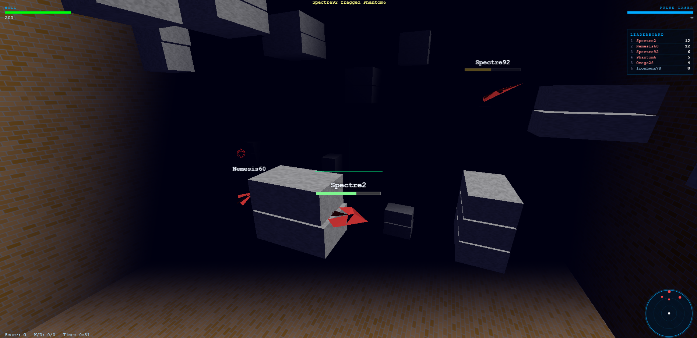

# FragArena



FragArena is a browser-based multiplayer 3D space shooter built with JavaScript (Three.js) and a Node.js backend.
Fully vibe-coded with Github Copilot

## Play Online

https://fragarena1.azurewebsites.net

## What It Is

- Up to 6 players per arena.
- Empty player slots are filled with bots.
- Fast-paced 6DOF movement in a bounded 3D combat arena.
- Procedural ships, arena shields, pickups, radar, leaderboard, and in-game chat.
- In-memory authoritative server state with a continuous 20 Hz game loop.

## Core Gameplay

- Human players join with a handle.
- If the arena is full of bots, the oldest bot is removed to make room.
- If the arena has 6 human players, join is rejected until a slot opens.
- Kills increase score; dead players respawn after a short delay.
- Bots are replaced after long sessions to keep matches balanced.

## Controls

- Mouse: Look
- Left Mouse Button: Fire
- W / A / S / D: Move
- Space: Move up
- Shift: Move down
- T: Open chat
- Esc: Quit match

## Weapons

Server-side weapon logic is authoritative.

| Weapon | Type | Damage | Fire Interval | Ammo | Notes |
|---|---|---:|---:|---:|---|
| Pulse Laser | Projectile | 30 | 400 ms | Unlimited | Default weapon |
| Instagib Laser | Raycast | 200 | 3000 ms | Unlimited | Pickup weapon, bright white beam, sonic boom |
| Rail Gun | Projectile | 15 | 150 ms | Unlimited | Pickup weapon |
| Missiles | Homing projectile | 60 | 2000 ms | 6 | Pickup weapon |

Pickup weapons expire after a timed duration, or when ammo is exhausted (if limited).

## Tech Stack

- Frontend: Vanilla JavaScript + ES modules
- 3D Rendering: Three.js (CDN)
- Backend: Node.js (ES modules)
- Transport: WebSocket (`ws` library) — HTTP and WebSocket share the same port
- State Storage: In-memory (no database or file I/O required at runtime)

## Project Structure

```
FragArena/
├── index.html              # Game client entry point
├── package.json            # Root package (start/dev scripts)
├── css/
│   └── style.css
├── js/                     # Client-side ES modules
│   ├── main.js
│   ├── game.js
│   ├── player.js
│   ├── weapons.js
│   ├── renderer.js
│   ├── arena.js
│   ├── hud.js
│   ├── radar.js
│   ├── input.js
│   ├── network.js
│   ├── chat.js
│   ├── procedural.js
│   └── sound-manager.js
├── assets/                 # Static assets (images, etc.)
├── music/                  # MP3 tracks (served dynamically via manifest endpoint)
├── data/
│   └── game_state.json     # Legacy / reference only (not used at runtime)
└── server/                 # Node.js backend
    ├── server.js           # HTTP + WebSocket server, game loop
    ├── package.json
    ├── handlers/           # WebSocket message handlers
    │   ├── join.js
    │   ├── input.js
    │   ├── leave.js
    │   ├── chat.js
    │   ├── reset.js
    │   └── state.js
    └── lib/                # Core game logic
        ├── GameState.js
        ├── GameTick.js
        ├── Weapons.js
        └── BotAI.js
```

## Local Development

### Prerequisites

- Node.js 18 or newer

### Install Dependencies

```powershell
npm install
```

### Run Locally

```powershell
npm start
```

Or with auto-restart on file changes:

```powershell
npm run dev
```

Then open:

http://localhost:8080

Notes:

- HTTP and WebSocket both run on port 8080 (or `PORT` environment variable).
- The server serves all static files from the project root.
- Game state is held entirely in memory; no files are written at runtime.
- The music manifest is served dynamically at `/music/manifest.php` (no PHP required).

## WebSocket Message Types

The client and server communicate exclusively over WebSocket.

| Direction | Type | Description |
|---|---|---|
| Client → Server | `join` | Join the arena with a handle |
| Client → Server | `input` | Player movement and actions |
| Client → Server | `chat` | Send a chat message |
| Client → Server | `leave` | Leave the arena |
| Client → Server | `reset` | Reset arena state (debug/admin) |
| Server → Client | `state` | Full game snapshot (pushed at 20 Hz) |
| Server → Client | `error` | Error response |

## Debug Console Commands

Open browser dev tools and use:

- `debug.help()`
- `debug.weapons()`
- `debug.weapon("pulse")`
- `debug.weapon("instagib")`
- `debug.weapon("rail")`
- `debug.weapon("missile")`
- `debug.info()`

## Known Issues

- **Mouse capture (Firefox):** Firefox does not always honour the Pointer Lock API request,
  meaning the mouse may not be captured when clicking into the game. Chrome is recommended
  for the best experience.
- `debug.setHealth(100)`

## Project Structure

- `index.html` — Game shell and HUD
- `js/` — Client systems (rendering, input, weapons, networking, HUD, audio)
- `api/` — PHP HTTP endpoints
- `lib/` — Game simulation/state classes
- `data/` — Server state file
- `assets/`, `css/`, `music/` — Frontend resources

## Deployment

Production URL:

https://fragarena1.azurewebsites.net
